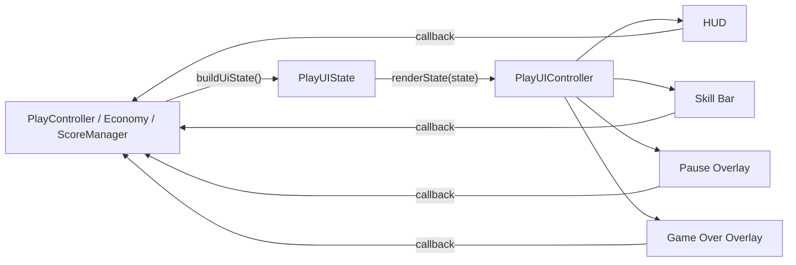

# 游戏页整体重构文档

> 文档状态：实施基线  
> 适用版本：Cocos Creator 3.8.8  
> 目标平台：微信小游戏，Web 预览  
> 实施分支：`codex/piece-refactor`  
> 关联文档：`棋子重构文档.md`  
> 本文覆盖游戏页整体布局、UI 架构、交互反馈、暂停设置、结算层和素材治理，不改变当前玩法规则。

## 1. 重构结论

游戏页采用“固定结构在 Scene/Prefab、动态状态由控制器渲染、玩法只输出纯数据和回调”的方式重构。

第一阶段以当前已经实现的无尽分数制为准，界面只展示真实存在的数据：设置、分数、当前下落棋子、5×7 棋盘、三种技能、技能提示、暂停设置和游戏结束结算。

设计参考中的“关卡、目标、剩余步数、下一枚、通关星级”属于后续关卡模式能力。现阶段没有对应的数据模型和规则，不能为了还原设计稿而写死假数据。

整体重构必须满足以下原则：

- 设置按钮保持在左上角，并避开微信原生胶囊。
- 顶部中央保留棋子的出生与下落通道，不用大型 HUD 遮挡。
- 棋盘几何仍由 `BoardFill` 和 `BoardGeometry` 统一计算。
- 棋盘装饰继续由 `PlayUIController.ensureBoardDecorations()` 使用 `Graphics` 绘制。
- UI 只能通过回调发出操作，不直接修改棋盘、分数、库存或暂停状态。
- 固定面板和按钮不再大量依赖运行时补节点。
- 素材使用小图、九宫格和动态文字，禁止整页切图进入运行时资源。

## 2. 重构目标与非目标

### 2.1 目标

1. 建立清晰的顶部 HUD、棋盘区、技能区和覆盖层四级结构。
2. 解决 Scene 固定节点与脚本运行时补建节点混杂的问题。
3. 保留 `PlayController.buildUiState()` → `PlayUIController.renderState()` 的单向数据流。
4. 让 750×1335 设计分辨率在全面屏、微信胶囊和底部安全区下保持稳定。
5. 统一按钮按压、禁用、选中、提示、遮罩和弹窗动画规范。
6. 将暂停设置稿、游戏结算稿落实为可维护的 Scene/Prefab 结构。
7. 降低 `PlayUIController` 的横向职责和运行时节点创建数量。
8. 将游戏页运行时素材控制在适合微信小游戏的体积范围内。

### 2.2 非目标

- 不修改 5 列 × 7 行棋盘。
- 不修改落子、BFS 合并、低位锚点、重力和连锁规则。
- 不修改炸弹、锤子和交换技能的结算规则。
- 不在第一阶段新增关卡、目标、步数、下一枚预览或星级算法。
- 不修改 `assets/scence/` 的历史目录名称。
- 不把游戏页改成一张不可交互的整屏图片。
- 不在 UI 脚本中直接增减金币、技能库存或体力。

## 3. 当前实现基线

### 3.1 设计分辨率

项目设计分辨率为：

```text
750 × 1335
```

来源：`settings/v2/packages/project.json`

`game.scene` 当前主节点约为 750×1334，接近设计分辨率。重构应继续以 750 宽为排版基准，通过 Widget、安全区和等比缩放适配设备，不建立第二套横向坐标体系。

### 3.2 当前场景层级

文件：`assets/scence/game.scene`

```text
Canvas
└─ Main
   ├─ Status
   │  └─ Content
   │     ├─ SettingsBtn
   │     └─ Score
   │        ├─ Label
   │        └─ Number
   ├─ board
   │  ├─ BoardFill
   │  └─ column1 ... column5
   ├─ SkliisController
   │  ├─ Skill1 / BombBtn / Box
   │  ├─ Skill2 / HammerBtn / Box
   │  └─ Skill3 / V_RocketBtn / Box
   └─ PauseOverlay
      ├─ Mask
      ├─ Panel
      │  ├─ SettingLabel
      │  ├─ BgSound
      │  ├─ Notifications
      │  ├─ CloseBtn
      │  └─ Play
      ├─ Home
      └─ Repay
```

游戏结束层目前由 `PlayUIController.ensureGameOverOverlay()` 和 `GameOverOverlayController` 在运行时补建，不存在完整的静态 Scene 层级。

### 3.3 当前关键尺寸

| 区域 | 当前尺寸或位置 | 说明 |
| --- | --- | --- |
| `Main` | 750×1334 | 游戏页根节点 |
| `Status` | 750×100 | 顶部安全区容器 |
| `board` | 650×894 | 棋盘外区 |
| `BoardFill` | 610×854 | 棋盘有效内区 |
| `pieceSize` | 112 | `game.scene` 序列化值 |
| `spacing` | 10 | 格子间距 |
| `SkliisController` | 650×164 | 底部技能栏 |

棋盘所需尺寸正好为：

```text
宽度 = 5 × 112 + 4 × 10 = 600
高度 = 7 × 112 + 6 × 10 = 844
```

`BoardFill` 比实际网格横纵各多 10 像素，相当于四周各留 5 像素。重构布局时必须保留这套几何关系，不能只按 TypeScript 中 `pieceSize = 120` 的默认值画设计。

### 3.4 当前职责边界

- `PlayController`：玩法流程、运行状态、输入、技能、合并、重力和场景切换。
- `BoardModel`：通用棋盘查询和清理。
- `BoardGeometry`：触摸、格子、出生点和棋盘坐标换算。
- `ScoreManager`：棋盘分数、奖励分和最高数字。
- `PlayUIController`：游戏页布局、状态栏、棋盘装饰、技能栏和覆盖层协调。
- `PauseOverlayController`：暂停弹窗、音量滑块和游戏内操作。
- `GameOverOverlayController`：游戏结束信息、按钮和显示动画。

这套逻辑边界是正确的，整体重构应保留；问题主要在 UI 内部职责过多、资源引用位置不合理和固定布局仍由脚本补建。

## 4. 当前问题与设计稿差距

### 4.1 固定布局与运行时结构混杂

`Status`、棋盘、技能栏和暂停层存在于 Scene；棋盘边框、技能提示、部分技能角标和游戏结束层又由脚本补建。结果是：

- 编辑器内看不到完整最终界面。
- 节点尺寸和层级容易被运行时代码再次覆盖。
- 视觉调整必须同时修改 Scene 和多个脚本常量。
- 缺失节点时的兼容逻辑逐渐变成正式逻辑。

### 4.2 PlayUIController 过重

`PlayUIController` 同时负责：

- 背景适配。
- 棋盘绘制。
- 顶部状态栏和微信胶囊适配。
- 分数滚动。
- 技能节点修复、状态、数量和提示。
- 暂停层与游戏结束层接入。
- 一次性消息提示。

它应该保留“接收状态并协调子组件”的职责，但不应继续承担每个固定控件的完整构建细节。

### 4.3 UI 资源仍挂在玩法控制器上

当前 `PlayController` 序列化了金币条 Prefab、技能数字贴图和游戏结束弹窗 SpriteFrame。这些属于表现资源，不应长期由玩法控制器持有。

目标是让 `PlayUIController` 或独立 UI 资源组件持有 UI 资源，`PlayController` 只传布局参数、纯状态和操作回调。

### 4.4 暂停设置尚未覆盖设计要求

当前运行时暂停设置包含音乐、音效、继续、返回首页和重新开始，但尚未完整接入设计稿中的：

- 转发好友。
- 客服反馈。
- 同一行等宽的返回首页与重新开始按钮。

`PlayController.shareGameFromPause()` 已经存在，但尚未通过暂停层回调接入按钮。客服反馈仍需要平台适配层。

### 4.5 结算模式概念混用风险

当前玩法结束条件是无尽模式棋盘填满，运行时数据包括：

- 本次得分。
- 最高合成数字。
- 金币奖励。
- 重新开始、回首页和分享。

已有设计稿展示的是“闯关成功 + 三星 + 双倍领取 + 继续”，这依赖关卡结果、星级规则和奖励领取状态。当前代码没有这些数据，因此不能直接把游戏结束层改名为胜利结算层。

## 5. 第一阶段产品决策

在没有新增玩法规则前，整体重构按以下默认决策执行：

| 项目 | 第一阶段决定 |
| --- | --- |
| 游戏模式 | 无尽分数制 |
| 顶部信息 | 设置 + 分数 |
| 金币与体力 | 游戏页不展示，保留在首页和商店 |
| 下一枚 | 不展示；当前只有正在下落的棋子，没有 next queue |
| 关卡/目标/步数 | 不展示 |
| 技能库存 | 可显示小角标；本局已用时显示锁定/已用状态 |
| 暂停设置 | 音乐、音效、分享、客服反馈、继续、首页、重开 |
| 结算 | 游戏结束版，不展示星级 |
| 三星结算 | 预留给后续关卡模式 |

这组决定不是永久限制，而是防止第一阶段 UI 出现没有业务来源的装饰数据。

## 6. 目标信息层级

游戏页从上到下分为四个主要区域：

```text
┌──────────────────────────────┐
│ 顶部安全区：设置 / 分数 / 胶囊 │
├──────────────────────────────┤
│ 棋子出生与下落通道             │
│                              │
│ 5 × 7 棋盘                   │
│                              │
├──────────────────────────────┤
│ 技能状态提示                  │
│ 炸弹 / 锤子 / 交换            │
└──────────────────────────────┘
```

### 6.1 顶部 HUD

- 设置按钮固定在左上角。
- 微信原生胶囊区域视为不可占用区。
- 分数使用紧凑卡片，位于左上设置按钮下方或其右侧，但不得进入中央出生通道。
- 顶部中央至少保留一枚棋子宽度加安全边距的下落通道。
- 游戏页不重复展示首页的金币和体力条。
- 设置按钮视觉尺寸可以是 56–64，但透明触摸热区不得小于 80×80。

### 6.2 出生通道

当前 `spawnOffsetY = 160`，棋子从接近屏幕顶部的位置生成。重构顶部 HUD 时必须基于真实出生点预览，避免分数卡、目标卡或胶囊遮挡中央列棋子。

出生通道只允许轻量虚线、箭头或极低透明度的列提示，不放大面积实色卡片。

### 6.3 棋盘

- 保持 5×7、112 像素棋子、10 像素间距的当前基线。
- `BoardFill` 仍是几何数据源。
- 棋盘外框、玻璃底色、交替列蒙版和虚线继续由 `ensureBoardDecorations()` 绘制。
- Scene 中只保留 `board`、`BoardFill` 和列占位节点，不重复放一张大型棋盘装饰图。
- 棋盘视觉不能比棋子更抢眼；边框、高光和列分隔保持低透明度。
- 新版棋子表现按照根目录 `棋子重构文档.md` 独立实施。

### 6.4 技能栏

三种技能保持一行等宽排列：

```text
炸弹          锤子          交换
```

每个技能需要四种状态：

1. 可用：正常饱和度。
2. 选中：轻微放大、描边或底板颜色变化。
3. 本局已使用：降低饱和度并显示锁定/已用标记。
4. 库存为零：显示加号或购买入口，但点击仍由逻辑层判断并提示。

库存角标只显示 `0–9`，超过 9 时显示 `9+` 或由产品确认上限。角标不能遮挡技能主体，也不能沿用接近技能按钮大小的大圆盘。

### 6.5 技能提示

- 提示跟随技能栏布局，不写死世界坐标。
- 使用高度约 36–44 的轻量提示条或气泡。
- 放在棋盘底边与技能栏之间，尽量不遮挡最底行棋子。
- 文案随炸弹、锤子和交换状态变化。
- 再次点击技能取消时，提示需要立即淡出。
- 提示节点只拦截自身需要的触摸；纯提示区域不应阻止棋盘输入。

## 7. 目标场景层级

第一阶段优先保留现有关键名称，减少 Prefab 和脚本引用断裂：

```text
Canvas
└─ Main
   ├─ Background
   ├─ Status
   │  └─ Content
   │     ├─ SettingsBtn
   │     └─ ScoreCard
   │        ├─ Icon
   │        └─ Value
   ├─ board
   │  ├─ BoardFrame             # 运行时 Graphics
   │  ├─ BoardFill
   │  ├─ BoardDashedLines       # 运行时 Graphics
   │  └─ column1 ... column5
   ├─ PieceLayer
   ├─ FxLayer
   ├─ SkliisController          # 继续兼容 SkillsController
   │  ├─ Skill1
   │  ├─ Skill2
   │  └─ Skill3
   ├─ FeedbackLayer
   │  ├─ SkillModeHint
   │  └─ Toast
   └─ OverlayLayer
      ├─ PauseOverlay
      └─ GameOverOverlay
```

### 7.1 迁移约束

- `board`、`BoardFill`、`Status`、`Content` 和三个 Skill 节点第一阶段不改名。
- 技能栏必须同时兼容历史名称 `SkliisController` 与 `SkillsController`。
- `PieceLayer` 若引入，必须与 `Main` 使用相同原点和缩放；迁移前先验证所有格子坐标。
- 为降低风险，第一阶段也可以继续把棋子挂在 `Main`，只先建立 `FxLayer` 和 `OverlayLayer`。
- 覆盖层必须始终高于棋子、技能栏和临时特效。
- `PauseOverlay` 和 `GameOverOverlay` 打开后必须吞掉底层棋盘触摸。

## 8. Scene、Prefab 与运行时代码边界

### 8.1 放在 Scene 中

- 背景节点。
- 顶部 HUD。
- 棋盘占位和列节点。
- 技能栏固定结构。
- 覆盖层挂点。
- 安全区 Widget 和基础锚点。

### 8.2 放在 Prefab 中

- `piece.prefab`。
- 可复用的设置面板结构。
- 游戏结束或后续关卡结算面板。
- 需要多个场景复用的 HUD 小组件。

首页和游戏页设置面板可以共享一个 Prefab，并通过 `context: 'home' | 'game'` 控制游戏操作区显隐；游戏状态下才显示“返回首页”和“重新开始”。

### 8.3 运行时生成

只保留真正动态、数量不固定或生命周期很短的内容：

- 棋子实例。
- 合并、爆炸、锤子和交换特效。
- 一次性提示文本。
- 缺失正式资源时的开发兜底。

标题、滑块、固定按钮、结算信息槽位等不应长期依赖 `getOrCreateNode()` 构建。

## 9. UI 架构

### 9.1 单向状态流



任何 UI 子组件都不能直接访问或修改 `board[row][column]`、分数仓库、经济仓库或技能结算状态。

### 9.2 PlayUIState

当前状态已经覆盖第一阶段主要需求：

```ts
export type PlayUIState = {
  currentValue: number | null
  score: number
  highestValue: number
  gameOverCoinReward: number
  isGameOver: boolean
  isPaused: boolean
  isResolving: boolean
  activeSkill: 'bomb' | 'hammer' | 'swap' | null
  coins: number
  skillCounts: Record<'bomb' | 'hammer' | 'swap', number>
  skillUsed: Record<'bomb' | 'hammer' | 'swap', boolean>
}
```

第一阶段可以保留 `coins` 兼容现有经济提示，但游戏 HUD 不展示金币条。若所有游戏页逻辑确认不再需要金币显示，再单独清理该字段，不在视觉改造过程中顺手删除。

### 9.3 操作回调

建议把当前很长的 `setup()` 回调参数收拢为明确的动作对象：

```ts
type PlayUIActions = {
  pause: () => void
  restart: () => void
  home: () => void
  share: () => void
  feedback: () => void
  useBomb: () => void
  useHammer: () => void
  useSwap: () => void
}
```

这只是 UI 事件出口；真正能否暂停、重开、分享或使用技能仍由 `PlayController` 判断。

### 9.4 子组件拆分建议

| 组件 | 职责 |
| --- | --- |
| `PlayUIController` | 接收状态、协调布局和分发给子组件 |
| `PlayHudController` | 设置按钮、分数动画和顶部安全区 |
| `PlaySkillBarController` | 技能状态、库存角标、选中反馈和技能提示 |
| `PauseOverlayController` | 暂停设置、音量、分享、反馈和游戏操作 |
| `GameOverOverlayController` | 无尽模式结束信息与操作 |

`ensureBoardDecorations()` 按项目约束继续留在 `PlayUIController`，不要为了形式拆出新的棋盘装饰组件。

### 9.5 资源引用归属

以下资源应逐步从 `PlayController` 移到 `PlayUIController` 或对应子组件：

- 游戏结束面板 SpriteFrame。
- 重新开始、首页、分享按钮 SpriteFrame。
- 技能数字贴图。
- 纯 UI Prefab。

`PlayController` 继续持有玩法特效和音频所需的资源，例如锤子施放图、炸弹施放图和玩法音效。

## 10. 顶部 HUD 重构

### 10.1 结构

```text
Status
└─ Content
   ├─ SettingsHitArea
   │  └─ SettingsIcon
   └─ ScoreCard
      ├─ ScoreIcon
      └─ ScoreValue
```

### 10.2 布局规则

- `Status` 贴顶并覆盖完整宽度。
- `Content` 根据微信胶囊顶部位置进行纵向对齐。
- 左边距包含安全区和至少 16–24 像素视觉留白。
- 设置按钮不居中，也不放到右上胶囊区域。
- 分数卡最多占用左侧可用区域，不跨越中央出生通道。
- Web 和编辑器没有微信数据时恢复 Scene 中的默认位置。
- 不在每次 `syncLayout()` 后把运行时位置覆盖为新的基准位置。

### 10.3 分数反馈

保留当前数字递增动画，但统一规则：

- 加分：80–360 ms 内滚动到目标值。
- 清零或重开：直接同步，不做向下滚动。
- 连锁时允许轻微缩放或星点反馈，但不能让整个 HUD 跳动。
- 分数文字使用项目字体或 BMFont，避免微信系统字体差异。

## 11. 棋盘与背景

### 11.1 背景

当前 `game.scene` 使用 `assets/images/World/World_3.png`，文件体积约 200 KB，明显优于同目录数 MB 的高清背景。重构时优先复用或替换为同级体积的运行时背景，不直接切换到 2–6 MB 的源图。

背景需要：

- 覆盖 750×1335 及更高屏幕比例。
- 主体细节避开棋盘数字区域。
- 顶部保持足够对比度，让设置和分数可读。
- 底部植物、花朵等不能遮挡技能按钮轮廓。
- 使用 `Sprite.SizeMode.CUSTOM` 配合 cover 逻辑，避免拉伸。

### 11.2 棋盘装饰

继续通过以下常量控制视觉：

- 外框阴影色。
- 玻璃主体色。
- 内区雾化色。
- 交替列蒙版色。
- 虚线宽度、长度、间距和透明度。

这些常量应集中在 `PlayUIController` 文件顶部或单一配置对象中，不散落到多个方法。

### 11.3 几何一致性

任何棋盘布局变更都必须同时检查：

- `BoardFill` 实际尺寸。
- `pieceSize` 与 `spacing` 的 Scene 序列化值。
- `BoardGeometry.getBoardGridOriginX/Y()`。
- 列节点位置和宽度。
- 触摸包围盒。
- 出生点与顶部 HUD 的关系。

视觉边框可以变化，逻辑有效区不能脱离 `BoardFill`。

## 12. 技能栏重构

### 12.1 固定结构

每个技能节点使用一致结构：

```text
Skill
├─ ButtonFace
├─ Icon
├─ Name
├─ Badge
│  └─ Count
├─ UsedMask
└─ SelectionRing
```

不再从其他技能节点复制缺失角标图片作为长期方案。兼容逻辑可以保留一个迁移周期，所有 Prefab/Scene 节点补齐后删除。

### 12.2 交互

- 点击可用技能：进入技能模式。
- 再次点击当前技能：取消技能模式。
- 切换到另一技能：由逻辑层决定先取消还是直接切换。
- 技能库存为零：不进入模式，显示购买或库存不足提示。
- 本局已经成功使用：保持置灰，点击显示“本局已使用”。
- 按压反馈只缩放 ButtonFace 或整体到 0.94–0.97，释放回弹不超过 1.03。

### 12.3 技能模式

技能模式期间：

- 普通下落冻结。
- 棋盘目标区域可以显示轻量轮廓或高亮。
- 非法目标不播放成功特效。
- 施放动画结束后统一进入全盘结算。
- 技能提示和选中态必须在结算开始前关闭，避免与合并动画叠加。

## 13. 暂停设置重构

### 13.1 目标内容

游戏中设置面板包含：

1. 音乐音量滑块。
2. 音效音量滑块。
3. 转发好友。
4. 客服反馈。
5. 返回首页。
6. 重新开始。
7. 继续游戏或关闭按钮。

“返回首页”和“重新开始”只在游戏中显示；首页设置面板隐藏这两个按钮。

### 13.2 目标层级

```text
PauseOverlay
├─ Mask
└─ Panel
   ├─ Title
   ├─ CloseButton
   ├─ MusicRow
   │  ├─ Icon
   │  └─ Slider
   ├─ SoundRow
   │  ├─ Icon
   │  └─ Slider
   ├─ UtilityActions
   │  ├─ ShareButton
   │  └─ FeedbackButton
   ├─ GameActions
   │  ├─ HomeButton
   │  └─ RestartButton
   └─ ContinueButton
```

### 13.3 布局规则

- “返回首页”和“重新开始”使用同一行、等宽、等高的横向胶囊按钮。
- 图标与文字在同一水平基线上，不使用大圆图标叠在文字上方。
- 返回首页为浅奶油色次操作，重新开始为珊瑚橙主操作。
- 两个滑块的轨道长度、控制点尺寸和触摸范围一致。
- 面板内容必须完整落在安全区内，不让底部按钮贴屏幕边缘。
- 遮罩吞掉所有底层输入，面板内部按钮各自阻止事件继续冒泡。

### 13.4 回调与平台适配

暂停设置只发出以下意图：

```ts
onContinue()
onShare()
onFeedback()
onHome()
onRestart()
onMusicVolumeChange(value)
onSoundVolumeChange(value)
```

- 分享复用现有 `GameShareAdapter` 和 `shareGameFromPause()`。
- 客服反馈由独立平台适配器处理；Web 不支持时显示明确提示。
- 返回首页继续执行现有“保存进行中快照后切场景”逻辑。
- 重新开始继续由 `PlayController` 判断体力和对局状态。
- 暂停层不直接清空棋盘或加载场景。

## 14. 游戏结束与关卡结算

### 14.1 第一阶段：无尽模式游戏结束

继续使用现有数据：

- 标题：游戏结束。
- 最高合成数字。
- 本次得分。
- 金币奖励。
- 重新开始。
- 返回首页。
- 分享。

固定标题、信息槽和按钮应在 Scene 或 Prefab 中完成。`GameOverOverlayController` 只刷新数值、控制显隐和播放动画，不再大量 `getOrCreateNode()`。

### 14.2 后续阶段：关卡胜利结算

已有设计稿包含三颗实心星与空心星状态，可用于关卡星级动画，但必须先新增明确的数据模型：

```ts
type LevelSettlementState = {
  result: 'victory' | 'failed'
  level: number
  score: number
  highestValue: number
  stars: 0 | 1 | 2 | 3
  coinReward: number
  canDoubleReward: boolean
}
```

在星级算法、失败条件、继续行为和双倍奖励流程未定义前，不把三颗星接入当前无尽模式游戏结束层。

### 14.3 动画规则

- 遮罩淡入约 160–200 ms。
- 面板从 0.92–0.96 缩放到 1，避免夸张弹跳。
- 关卡模式的星星从空心切换到实心，按左、中、右依次点亮。
- 点亮动画只切换同位置资源，避免星星跳位。
- 按钮在信息动画结束前可以稍晚 100–200 ms 出现。
- 关闭或切场景前停止整个节点树的 Tween。

## 15. 素材治理

### 15.1 运行时目录建议

```text
assets/images/Game/
├─ Hud/
├─ Skills/
├─ Settings/
├─ Settlement/
└─ Effects/
```

现有目录暂不强制一次性搬迁，避免大规模 `.meta` 和资源引用变更。优先对新素材采用目标目录，旧素材在引用迁移验证后再清理。

### 15.2 素材类型

| 类型 | 推荐方式 |
| --- | --- |
| 整屏背景 | JPG 或压缩后的不透明图片 |
| 面板和按钮 | 透明 PNG + 九宫格 |
| 小图标 | 裁切透明 PNG，统一图集 |
| 分数和普通文字 | 自定义字体 Label |
| 技能数字 | BMFont 或小型数字图集 |
| 棋盘玻璃和虚线 | `Graphics` 动态绘制 |
| 棋子 | 按 `棋子重构文档.md` 分层实现 |

### 15.3 体积预算

- 游戏背景目标不超过 500 KB。
- 普通小图标建议 5–30 KB，原则上不超过 50 KB。
- 单个九宫格面板建议不超过 100 KB。
- 单套弹窗运行时素材建议不超过 300 KB。
- 新增游戏页 UI 运行时素材总量目标不超过 1 MB，不含音频和动画帧。
- 不将 2–6 MB 的设计源图直接放入运行时引用。
- 不保留同一图标的多套历史导出版本。

需要同时关注压缩文件大小、图片画布尺寸和 RGBA 解压后的纹理内存，不能只看 Git 中的 KB 数。

## 16. 响应式与安全区

### 16.1 顶部

- 微信端读取胶囊矩形和窗口信息。
- 设置按钮位于左上安全区，不能镜像到右侧。
- HUD 不进入胶囊左边的危险边界。
- 中央出生通道在所有屏幕比例下保持可见。

### 16.2 底部

- 技能栏使用 Widget 贴底。
- 运行时只增加底部安全区高度，不重复累计。
- 技能按钮的视觉中心随安全区整体上移。
- 最底部触摸热区不贴设备手势条。

### 16.3 窄屏和长屏

- 以宽度适配为主，棋盘不能横向裁切。
- 长屏增加背景留白，不纵向拉伸棋盘格。
- 空间不足时优先缩小 HUD 与弹窗，而不是缩小棋子导致点击困难。
- 结算面板和设置面板使用统一的最大宽度与安全边距算法。

## 17. 交互与动画规范

### 17.1 按钮

- 可见尺寸与触摸热区分离，小图标也要有足够热区。
- 按下缩放到 0.94–0.97。
- 释放在 80–120 ms 内回弹。
- 禁用态不继续播放呼吸动画。
- 同一按钮的 Tween 启动前先停止旧 Tween。

### 17.2 遮罩与层级

- 暂停和结算遮罩必须覆盖全画布。
- 覆盖层显示时，棋盘输入完全冻结。
- `OverlayLayer` 永远位于 `FxLayer` 上方。
- 返回首页、重开或销毁场景时统一清理临时特效和 Tween。

### 17.3 反馈优先级

```text
结算弹窗 > 暂停设置 > 技能模式提示 > 一次性 Toast > 合并特效 > 背景装饰
```

高优先级反馈显示时，应暂停或隐藏容易造成视觉冲突的低优先级循环动画。

## 18. 实施步骤

### 阶段 A：建立基线

1. 在 Cocos Creator 3.8.8 记录 Web 预览截图。
2. 记录 750×1335、常见全面屏和微信开发者工具下的布局。
3. 验证 Scene 序列化的 `pieceSize = 112`、`spacing = 10` 和 `BoardFill = 610×854`。
4. 记录设置、技能模式、棋盘接近满格和游戏结束状态。

### 阶段 B：整理固定层级

1. 在 `game.scene` 中建立 Background、FeedbackLayer 和 OverlayLayer。
2. 保留现有关键节点名称和引用。
3. 把固定标题、按钮、滑块和信息槽从运行时补建迁移到 Scene/Prefab。
4. 确认覆盖层和特效层的 sibling 顺序。

### 阶段 C：顶部 HUD

1. 将设置按钮固定到左上安全区。
2. 重做紧凑分数卡，保留中央出生通道。
3. 将顶部安全区与微信胶囊适配收口到 `PlayHudController`。
4. 验证 Web 默认布局与微信布局都不会累计偏移。

### 阶段 D：棋盘与棋子

1. 保留 `ensureBoardDecorations()` 和当前网格几何。
2. 只调整玻璃色、虚线和边框视觉常量。
3. 按 `棋子重构文档.md` 完成棋子分层渲染。
4. 验证出生、落地、连锁、重力和技能触摸区域。

### 阶段 E：技能栏

1. 补齐三个技能统一节点结构。
2. 接入库存角标、选中态、本局已用态和库存为零态。
3. 将技能提示限制在预留区域。
4. 删除从其它技能复制节点的长期兼容路径。

### 阶段 F：暂停设置

1. 按设计稿重排两条滑块。
2. 增加转发好友和客服反馈。
3. 将返回首页和重新开始改为同一行等宽胶囊按钮。
4. 接入分享和反馈回调，不让 UI 直接执行平台或场景逻辑。
5. 验证游戏中显示操作区、首页设置隐藏操作区。

### 阶段 G：游戏结束层

1. 将固定结构迁移到 Prefab 或 inactive Scene 节点。
2. 保留当前无尽模式的数据与文案。
3. 接入压缩后的结算素材。
4. 验证重开、首页、分享、金币奖励和体力不足分支。
5. 关卡模式完成前只保留三星结算资源和文档，不接假数据。

### 阶段 H：清理与打包

1. 删除无引用的旧 UI 素材和运行时兜底节点构建代码。
2. 将纯 UI 资源引用从 `PlayController` 移到 UI 组件。
3. 检查 `.meta` 引用，由 Cocos 自动维护。
4. 检查微信小游戏包体、纹理内存和 Draw Call。
5. 分别预览正常游戏、暂停、技能和结算状态。

## 19. 文件改动范围

| 文件或目录 | 预期改动 |
| --- | --- |
| `assets/scence/game.scene` | 调整固定层级、布局、Widget 和组件绑定 |
| `assets/script/PlayUIController.ts` | 收口协调职责，保留棋盘 Graphics 绘制 |
| `assets/script/PlayController.ts` | 仅调整 UI 回调和资源注入，不改玩法流程 |
| `assets/script/PauseOverlayController.ts` | 接入分享、反馈和新设置布局 |
| `assets/script/GameOverOverlayController.ts` | 改为绑定固定节点并刷新状态 |
| `assets/script/PieceController.ts` | 按独立棋子重构文档实施 |
| `assets/prefab/piece.prefab` | 新版棋子节点结构 |
| `assets/images/Game/` | 新增压缩后的游戏页运行时素材 |
| `design/references/` | 只作为视觉参考，不建立运行时引用 |

原则上不修改 `BoardModel`、`ScoreManager`、合并搜索、重力和技能结算算法。

## 20. 验证清单

### 20.1 首屏与布局

- [ ] 设置按钮位于左上角。
- [ ] 微信胶囊不遮挡任何游戏 HUD。
- [ ] 中央出生通道没有大型 UI 遮挡。
- [ ] 分数卡清晰、紧凑且不会与棋子重叠。
- [ ] 背景、棋盘、技能栏和安全区没有拉伸或裁切。

### 20.2 棋盘与输入

- [ ] 新棋子正常生成。
- [ ] 拖动选列正常。
- [ ] 点击快速下落正常。
- [ ] 五列触摸区域与视觉列完全一致。
- [ ] 5×7 棋盘所有边缘格都在 `BoardFill` 内。

### 20.3 合并与重力

- [ ] 相邻同值合并正常。
- [ ] 低位锚点规则不变。
- [ ] 多段连锁正常。
- [ ] 重力下落正常。
- [ ] 分数递增动画与实际得分一致。

### 20.4 技能

- [ ] 炸弹、锤子和交换按钮状态正确。
- [ ] 技能期间普通下落冻结。
- [ ] 技能库存为零时有明确提示。
- [ ] 本局已使用后按钮置灰且不能再次成功施放。
- [ ] 技能结束后进入全盘结算。
- [ ] 技能提示不会拦截无关棋盘触摸。

### 20.5 暂停设置

- [ ] 音乐滑块可拖动并持久化。
- [ ] 音效滑块可拖动并持久化。
- [ ] 转发好友能够调用平台适配层。
- [ ] 客服反馈在支持平台可用，不支持平台有提示。
- [ ] 返回首页会保存进行中快照。
- [ ] 重新开始经过逻辑层检查。
- [ ] 继续和关闭都能恢复游戏。
- [ ] 暂停遮罩完全阻止底层输入。

### 20.6 结算

- [ ] 游戏结束分数、最高数字和金币奖励正确。
- [ ] 重新开始、首页和分享入口正确。
- [ ] 没有把无尽模式误显示为闯关成功。
- [ ] 当前阶段不显示没有规则来源的星级。
- [ ] 打开结算后棋盘输入和技能按钮失效。

### 20.7 生命周期

- [ ] 暂停/恢复正常。
- [ ] 返回首页/继续游戏正常。
- [ ] 重新开始后 UI 和棋盘全部复位。
- [ ] 游戏结束后不会保存进行中快照。
- [ ] 场景销毁时事件、Tween 和临时特效全部清理。

### 20.8 平台与性能

- [ ] Cocos Creator 3.8.8 中资源引用无丢失。
- [ ] Web 预览无报错。
- [ ] 微信开发者工具布局正常。
- [ ] 微信真机字体、透明边缘和安全区正常。
- [ ] 新增 UI 素材符合体积预算。
- [ ] 没有每帧创建固定 UI 节点或独立材质。

## 21. 风险与回滚

### 21.1 主要风险

- 修改 `game.scene` 时破坏 SpriteFrame、Prefab 或脚本组件引用。
- 移动棋子父节点后改变坐标系，导致落点和触摸偏移。
- OverlayLayer 层级错误，暂停后仍能操作棋盘。
- HUD 占用中央出生通道。
- 将设计稿中的关卡信息错误接入当前无尽模式。
- 新素材未经压缩导致微信包体再次增长。

### 21.2 控制方式

- 每个阶段独立提交，避免 Scene、玩法和全部素材一次性混改。
- Scene 修改后立即在 Cocos Creator 中检查资源引用。
- 棋盘几何和 PieceLayer 迁移分开实施。
- 保留旧节点名称兼容一个迁移周期。
- 正式资源缺失时允许开发兜底，但验收后必须删除无用路径。

### 21.3 回滚

回滚优先对独立提交执行 Git revert，不使用覆盖整个工作区的破坏性命令。任何回滚只触及本阶段的 Scene、UI 脚本和资源，不回退无关玩法改动。

## 22. 完成定义

满足以下条件才算完成游戏页整体重构：

1. 顶部 HUD、棋盘、技能栏、暂停设置和游戏结束层形成统一视觉体系。
2. 设置按钮稳定在左上，微信胶囊与中央出生通道均无冲突。
3. 固定 UI 主要由 Scene/Prefab 管理，运行时代码只处理动态状态和短生命周期内容。
4. `PlayUIState` 单向渲染和回调边界保持完整。
5. 5×7 棋盘、合并、重力、暂停、技能和游戏结束全部验证通过。
6. 暂停设置包含音乐、音效、分享、反馈、首页、重开和继续。
7. 当前无尽模式结算不伪造关卡与星级数据。
8. Cocos Creator、Web、微信开发者工具和真机的关键界面均完成检查。
9. 旧运行时素材和无用兜底在验证后清理，包体没有明显增长。

## 23. 视觉参考

- `design/references/design_game_level_v23_icon_objective.png`
- `design/references/design_game_level_v16_square_skill_edges_fixed.png`
- `design/references/design_tiles_2_to_8192_complete_v3.png`
- `design/references/design_tiles_2_to_8192_with_frozen_states_v2.png`
- `design/settings/settings-popup-game-v3.png`
- `design/settlement/settlement-victory-v2.png`
- `design/settlement/settlement-victory-empty-stars-v1.png`

参考图用于确定手绘蜡笔风格、视觉层级、按钮比例、技能状态和未来关卡模式方向。正式实现必须以当前玩法数据、750×1335 布局和运行时素材预算为准。
