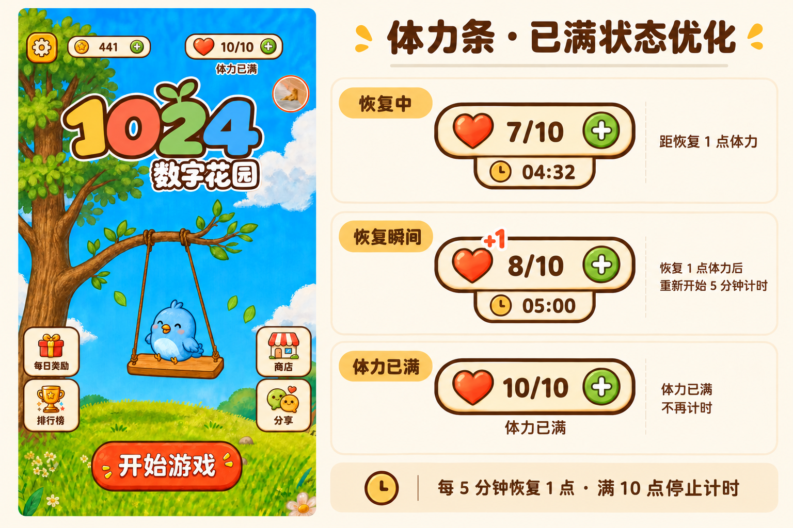

# 体力条、恢复计时与服务端同步方案

日期：2026-10-07。状态：设计已确认，本文为后续实现依据；本次只交付文档与设计参考图，尚未修改玩法、预制件、接口或数据库。

## 1. 意图与范围

体力条同时承担资源状态展示和获取入口：玩家能看清当前体力、距离下一点恢复的时间，并通过体力条进入未来的体力获取弹窗。主条和弹窗必须复用同一份经济状态，服务端负责登录账号的最终余额与恢复时间，客户端负责展示和发起操作。

已确认的设计如下：



| 状态 | 主条 | 主条下方 | 表现 |
| --- | --- | --- | --- |
| 恢复中 | 爱心、`7/10`、绿色加号 | 奶油色下挂标签：时钟、`04:32` | 表示距离恢复下一点的时间 |
| 恢复成功 | 数值更新为 `8/10` | 尚未满时更新为 `05:00` | 已确认恢复后轻量飘出 `+1` |
| 体力已满 | 爱心、`10/10`、绿色加号 | 小号暖棕色「体力已满」 | 无底板、无叶芽、无倒计时 |

保持现有奶油色、珊瑚色爱心、深暖棕轮廓和绿色加号。蓝天背景上的「体力已满」可使用细奶油色描边保证可读性。主条在状态切换时保持尺寸与位置，下方保留相同的状态区，避免布局跳动。数字与文案使用 Label，不烘焙进位图。

参考图用于确认体力组件的视觉，不代表重做首页；首页布局以当前 `main` 为准，不因参考图恢复其他旧版资源条或改变金币展示位置。

后续首期实现包括：统一体力预制件、恢复倒计时、服务端时间校准、消费/奖励后的同步与异常处理，以及未来弹窗的统一入口。详细获取弹窗的排版、视频奖励、购买规则、每日限制等属于后续功能；本文不设定未确认的奖励额度或商业化规则。

## 2. 分支与基线

本次客户端已执行：

```sh
git fetch origin main
git switch --no-track -c codex/energy-recovery-design origin/main
```

- 客户端仓库：`zoe249/1024`。
- 工作分支：`codex/energy-recovery-design`。
- 起点：获取后的 `origin/main`，提交 `95f4942693e0747da014beab3ecbfe940f70ea24`。
- 分支为本地独立分支，没有 upstream，也不追踪 `origin/main`。
- 用户已授权将同名分支推送到远程；前端提交文档与定稿参考图，后端仅推送分支起点。本方案不包含合并或部署。

后端仓库 `zoe249/1024_service` 也已从获取后的 `origin/main` 创建并切换到同名独立分支 `codex/energy-recovery-design`，起点为 `747ba8c6ddfac6995516f51d15c034e752056aa3`。该分支同样使用 `--no-track` 创建，没有 upstream。两个仓库各自维护同名分支，本次没有修改后端功能。

两个项目均明确推送 `refs/heads/codex/energy-recovery-design` 到 origin 的同名分支，不使用 `-u`，并关闭本次推送的 `push.autoSetupRemote`，保留本地无 upstream 状态。后端自动发布工作流仅匹配 main/dev，本次推送功能分支不会触发该部署流程。

编写方案时，后端现状核对依据为此前本机 `dev` 源码（`a1056f5`）；它不是此次独立分支的起点，也不能据此声称正式服务已具有本文拟新增的契约。后续从独立分支实现时应核对 main 基线与 dev 的差异，避免覆盖开发环境已有功能。后端继续遵循独立仓库和开发环境流程，默认集成/推送 `dev`，只有明确要求上线时才更新 `main`。

## 3. 当前代码与实现缺口

| 位置 | 已有能力 | 本次方案要求 |
| --- | --- | --- |
| `assets/prefab/EnergyBar.prefab` | 已有背景、图标、多个爱心和 MoreButton | 复用既有资源身份，将内部结构调整为定稿数值主条与状态区 |
| `assets/scence/home.scene` | 配置 energyBarPrefab，同时存在 StaminaResource | 首页实际使用唯一的体力预制件实例 |
| `assets/script/home/StartPageController.ts` | 层级模式使用 StaminaResource，旧模式才实例化 EnergyBar；运行时数值盖住素材示例数字 | 两条显示路径统一接入预制件，移除重复显示和示例数字遮盖依赖 |
| `assets/script/home/HomeSceneController.ts` | 定时刷新资源；体力点击当前直接分享；会话恢复时同步 | 接入体力展示状态、同步调度和获取入口回调 |
| `assets/script/economy/PlayerEconomyStore.ts` | 本地 300 秒恢复、存档、消费与奖励；读取快照会本地恢复 | 区分游客本地规则和登录账号服务端状态，提供纯数据计时信息 |
| `assets/script/online/sync/PlayerCloudSyncStore.ts` | 同步经济快照，应用操作结果 | 接收并保存 serverTime，防止旧响应与未确认操作覆盖新状态 |
| `assets/script/online/sync/PlayerSyncOutbox.ts` | energy_consumed/share_reward 队列及 operationId | 保留幂等重试；自然恢复不入队；已登录账号未确认操作不得静默丢弃 |
| 后端 `src/services/player-sync-service.ts` | 300 秒惰性恢复、事务、账号锁、操作去重、返回 serverTime | 修正未满消费重置计时问题，明确恢复时间与状态契约 |

客户端和已阅读的后端目前都会在消费时重置恢复基点。客户端同步链路虽然能取得 `serverTime`，当前没有将它用于倒计时。实现应补齐这些缺口，避免只加一个首页计时 Label。

## 4. 预制件与组件职责

### 4.1 体力条必须使用预制件

继续使用 `assets/prefab/EnergyBar.prefab`，保留原路径、`.meta`、资源 UUID 和场景序列化引用。静态节点、锚点、字体和图标在 Creator 内维护，脚本只控制布局适配、状态渲染和动态表现。

建议内部层级如下；节点名为后续实现建议，并非本次已创建的节点：

```text
EnergyBar                         统一交互范围，挂 EnergyBarController
├─ MainBar                        固定尺寸的主条
│  ├─ Background
│  ├─ Icon                        爱心
│  ├─ ValueLabel                  例如 7/10
│  └─ MoreButton                  绿色加号
├─ StatusArea                     固定占位，切换时不推动主条
│  ├─ RecoveryTab
│  │  ├─ Background
│  │  ├─ ClockIcon
│  │  └─ CountdownLabel           例如 04:32
│  └─ FullLabel                   体力已满，无底板
└─ GainFeedback                   短暂 +1，默认隐藏
```

- 建议新增 `assets/script/economy/EnergyBarController.ts`，通过序列化属性引用内部节点。
- `renderState(state)` 只渲染纯数据；组件发出 `onAcquireTap`，不直接分享、领取、扣体力、请求网络或改存档。
- 主条和加号均可触发获取入口，同一次点击只回调一次，避免父子点击重复响应。
- 满体力时保留获取入口，未来仍能查看恢复规则与获取方式；可领取状态由弹窗业务数据决定。
- 首页整体控制器负责安全区和主条定位。首页层级模式与旧模式均实例化或引用此预制件，不能继续分别绘制两套体力条。
- 迁移旧 StaminaResource 时检查层级引用和监听；兼容期间也只显示一个体力条。不得为实现新样式改动无关场景节点或资源 UUID。
- 预制件根节点的 UITransform 应覆盖主条和状态区，预留倒计时空间，并验证标题、头像、微信顶部安全区不会重叠。

### 4.2 为后续获取弹窗预留统一入口

通过首页业务协调层的 `openEnergyAcquire()` 接收点击，后续只在此处接入弹窗，体力条内部无需知道有哪些获取方式。

未来弹窗也采用独立预制件，例如 `assets/resources/Energy/EnergyAcquirePopup.prefab`，由业务层按需加载、实例化并复用；采用纯数据 `renderState()` 和操作回调。该路径是拟议路径，后续创建时必须核对实际加载地址，不提前写入一个不存在的资源引用。

未来弹窗展示当前体力、自然恢复规则和各获取方式的可用状态。分享可沿用当前流程；视频、金币或付费方式只在具体规则和服务端校验实现后展示。关闭弹窗不会停止自然恢复，弹窗与顶部条订阅同一份状态；奖励成功后同时刷新两处。

首期若尚未实现弹窗，`openEnergyAcquire()` 可适配到现有分享入口，保持当前能力；不以空白弹窗代替有效操作。未来奖励发放仍由经济/网络层完成，不能写入 UI 组件。

## 5. 恢复规则

正常容量为 10 点，恢复间隔为 300 秒。登录账号的容量、恢复基点和实际入账由服务端确认。

1. 满体力时停止计时，不累计溢出恢复额度。
2. 从满体力消费到未满，使用服务端确认消费的时间开始新的 300 秒周期。
3. 已未满时继续消费，先按服务端时间结算已到期的恢复，再扣体力；若结算后依然未满，保留已有周期，不因为又玩一局而推迟恢复。
4. 每个完整周期恢复 1 点。仍未满时保留不足一个周期的余量；达到上限时清除溢出时间。
5. 分享等额外奖励先结算自然恢复。奖励后仍未满时保留周期，奖励后已满时停止周期。
6. 续局不重复扣体力，新开和重玩沿用当前每局 1 点的消费规则。
7. 关闭游戏、后台和切场景期间照常计算时间；返回时重新获取服务端状态，不能依靠组件定时器补发体力。

服务端可以继续使用惰性结算，不需要为每位玩家开启常驻定时器。每次读写相关经济状态时，以事务内一致的服务端时间 `t` 结算：

```text
I = 300 秒
L = lastEnergyRecoveryAt
未满时 recovered = floor(max(0, t - L) / I)
energy = min(maxEnergy, energy + recovered)
仍未满：L = L + recovered × I
已满：本轮恢复停止，后续满→未满时设置新的 L
```

恢复时间非法或晚于服务端当前时间时，由服务端修正并返回状态，客户端不自行授予体力。异常历史数据的修复不得重置所有正常玩家的恢复进度。

## 6. 服务端同步契约

### 6.1 复用现有同步链路

优先扩展现有 `POST /sync`，复用鉴权、事务、账号锁、operationId、cloudRevision 和操作结果。自然恢复由服务端计算，客户端不上传 `energy_recovered`，也不能直接提交一个修改后的登录账号余额。

现有响应已包含：

| 字段 | 用途 |
| --- | --- |
| `serverTime` | 本次处理使用的服务端 UTC 时间 |
| `cloudRevision` | 服务端经济/进度快照版本 |
| `snapshot.economy.energy` / `maxEnergy` | 已确认的体力余额与上限 |
| `snapshot.economy.lastEnergyRecoveryAt` | 未满状态下的当前恢复周期基点 |
| accepted/duplicate/rejected 操作结果 | 确认、去重或拒绝待同步操作 |

建议在 `snapshot.economy` 增加两个兼容字段：

- `energyRecoverySeconds: 300`：由服务端返回恢复间隔。
- `nextEnergyRecoveryAt: string | null`：未满时为下次恢复的 UTC 时间，已满时为 null。

新增字段是拟议契约，并非当前已上线能力。旧客户端可以忽略新字段；过渡期新客户端可根据已有 lastEnergyRecoveryAt 和固定 300 秒推导目标时间，但仍必须使用返回的 serverTime。客户端不能把缺失字段默认为「体力已满」，也不能本地改写服务端时间。

GET 类经济状态入口若以后新增，也必须在返回快照前结算恢复；只读数据库旧余额会让顶部条与弹窗状态不一致。所有恢复、消费、奖励和版本更新在同一账号事务内完成，两个设备不能同时消费同一份余额。

### 6.2 客户端计时与刷新

建议由经济/同步层提供以下纯展示数据，不将网络请求放在预制件：

```ts
type EnergyBarState = {
  energy: number
  maxEnergy: number
  status: 'recovering' | 'full' | 'syncing'
  remainingSeconds: number | null
  isConfirmed: boolean
}
```

每次响应到达后，以 serverTime 建立服务端时钟锚点；运行期间用单调递增的计时源计算经过时长，避免修改手机时间使体力加速。可使用请求往返时间估计误差，但客户端计时仅作显示，恢复入账仍等待服务端确认。单调时钟不跨进程保存，重启和返回前台重新校准。

```text
estimatedServerNow = serverTimeAnchor + elapsedMonotonicTime
remainingSeconds = ceil(max(0, nextEnergyRecoveryAt - estimatedServerNow) / 1000)
```

每秒只更新 Label，使用固定数字宽度，禁止每秒请求服务端。倒计时到 0 时触发一次合并同步；等待期间可以显示 `00:00`，不得本地把余额加一或抢先播放 +1。失去有效时钟锚点时使用 `--:--` 表示待校准，通过现有提示机制说明同步情况，不伪造 `05:00`。

同步成功后判断变化原因：仅对当前可见页面、已确认且由恢复/奖励造成的增加播放一次反馈。首次加载、多设备校准、关闭游戏期间补回多点体力不逐点播放动画，也不能把余额回滚误认为奖励。

| 触发时机 | 处理 |
| --- | --- |
| 恢复登录会话、重新进入首页 | 拉取并应用服务端状态 |
| 微信返回前台、网络恢复 | 合并请求，校准余额和计时 |
| 下次恢复倒计时到 0 | 一次同步，成功后刷新下一周期 |
| 新开/重玩消费、分享等奖励完成 | 提交操作并确认结果，刷新所有展示 |
| 未来打开获取弹窗 | 使用当前状态立即展示，合并刷新 |
| 长时间停留在前台 | 可用约 60 秒低频校准发现多设备变化；满体力时不进行恢复边界请求 |

调度应跨页面合并请求，同一个同步批次在途时复用 Promise。失败按例如 5、15、30、60 秒退避，不在 `00:00` 时每秒重试；后台停止 UI 刷新和重复请求，前台恢复时校准。401 进入现有会话恢复逻辑，恢复登录后重试，不能因为网络失败切到正式接口。

### 6.3 消费、奖励、离线与并发

- 在线且已登录时，新开/重玩应确认体力消费被服务端接受后再创建新对局。重复点击锁定为同一次操作，重试复用 operationId，响应丢失也不能再次扣费。
- 现有已接受/重复/拒绝结果都需分别处理。体力不足时刷新服务端余额并显示补充提示；不能把 HTTP 成功等同于每条操作成功。
- 未登录游客可沿用本地恢复与消费，不强制因观看体力条而登录；首次登录沿用一次性游客导入策略，由服务端校验数据。游客状态不宣称具有跨设备同步保证。
- 已登录离线时保留最近确认的余额和未确认队列，冻结新增自然恢复入账。倒计时可以展示估计时间，到期只等待同步。默认可保留现有离线消费能力，但只使用缓存确认余额减去待确认消费后的可用额度；不本地发放分享等网络奖励。
- 离线操作仍标记为未确认；联网后提交同一 operationId 并以服务器结果校准。多设备可能导致离线消费被拒绝，必须展示拒绝原因，不能清空用户进行中的棋盘，也不能声称离线能保证全局消费一致。严格禁止离线开新局属于额外产品选择，本方案不默认扩大到该限制。
- 多设备使用同一个账号服务端状态，每台设备收到响应后只应用非过期版本。相同 cloudRevision 的响应还应比较校准时间，避免较旧时钟锚点覆盖较新的时间。
- sync 发出后新产生的操作不能被旧响应覆盖。应用确认快照时先剔除本批已处理操作，再按顺序将仍未确认的本地操作重建为暂存视图；重建不得重新入队或再次触发奖励。不能简单保留「本地和服务端取较大值」。
- 现有同步每次最多处理 3 批、每批 100 条，应检查是否仍有待同步操作；只合并剩余操作形成暂存视图并继续调度，不能把一次请求当成所有操作均已完成。队列达到容量时不能静默丢弃已登录账号尚未确认的经济操作。
- 服务端不根据客户端 occurredAt 发放额外自然恢复。延迟上报的满→未满消费按服务端接受时间启动恢复；如未来需要离线历史时间重放，应另行定义可信时序规则。
- 开发/体验/Web 使用开发接口，正式版使用正式接口；体力存档、会话、安装标识与操作队列继续按接口地址隔离。实现时还需确保账号切换不会带入上一账号的确认余额或待确认操作。

## 7. 资源、生命周期与实施顺序

新样式优先复用现有素材。体力图标、背景和未来弹窗位图按 `Skills/cocos-cream-ui-assets/SKILL.md` 制作并检查有效尺寸、Alpha、文件体积和缩小效果；动态文字独立渲染。新增运行时素材放在实际引用目录，避免主包无必要增长。

本文的设计参考图保存在 `文档素材/体力条/`，位于 `assets/` 外，仅用于阅读文档，不作为运行时素材，不会导入微信小游戏主包。

建议实施顺序：

1. 服务端补齐计时规则与兼容字段，验证非满消费不会推迟恢复、并发/幂等和奖励达到上限的行为。
2. 客户端经济/同步层接入服务端时钟、确认余额与未确认视图，保留游客路径，处理旧契约与失败重试。
3. 在 Creator 中维护 EnergyBar 预制件与组件，统一首页显示路径，绑定入口回调，接入 +1 反馈。
4. 联调首页、新开、重玩、续局、分享和前后台切换；为详细获取弹窗保留统一入口，后续再实现具体获取方式。

预制件隐藏/销毁时解绑事件、停止 Tween 和局部 UI 定时刷新；全局状态订阅退订。场景销毁后的异步返回不能访问失效节点。经济状态、同步队列和 OngoingGameSession 只能保存纯数据，不跨场景持有体力条或弹窗节点。

客户端功能继续在独立分支开发。后端日常联调使用 `/home/ubuntu/projects/1024_service_dev`、`game_1024_dev` 和开发接口，数据库若确需变更新增迁移。默认不改正式目录、不用正式数据测试，本方案不包含功能上线。

## 8. 验收标准与当前验证

| 场景 | 预期结果 |
| --- | --- |
| `7/10`，下次恢复剩 272 秒 | 主条 `7/10`，下挂计时 `04:32` |
| 恢复边界服务端确认成功 | `8/10`，新周期 `05:00`，最多一次 +1 |
| 网络较慢、边界请求失败 | 不提前加体力，不每秒重试，恢复网络后校准 |
| `9/10` 自然恢复或奖励到满 | `10/10`，隐藏计时底板，显示无底板「体力已满」 |
| 满体力停留 1 小时再消费 | `9/10`，从本次消费确认开始 300 秒，没有积攒恢复额度 |
| `7/10` 剩 `04:32` 时再消费 | 未到恢复边界时变为 `6/10`，原计时继续，不能重置为 `05:00` |
| 从周期起点离线 12 分 20 秒，原为 `7/10` | 联网后服务端结算为 `9/10`，距下一点 160 秒，即 `02:40` |
| 离线足够久达到上限 | 联网一次结算到 10；无溢出体力，无长串补发动画 |
| 已登录修改手机时间/重启 | 不因本地时钟变化获得额外体力；重新同步校准 |
| 双设备并发消费最后 1 点 | 服务端最多接受一次有效消费，另一请求得到不足/拒绝结果 |
| 重复请求、响应丢失后重试 | 同一 operationId 只消费或发奖一次 |
| 同步在途时新增消费/奖励 | 旧响应不覆盖新产生的待确认操作 |
| 续局、暂停/恢复、返回首页 | 续局不重复扣费，计时不中断，状态一致 |
| 三种技能、连锁与游戏结束 | 不受体力 UI 和同步调度影响 |
| 开发/正式环境、账号切换 | 各环境和账号的数据不串用 |
| 常规屏/长屏、Creator 重新导入 | 唯一体力预制件实例，引用完整，无顶部安全区或标题遮挡 |
| 未来弹窗开启、关闭和奖励完成 | 主条和弹窗状态一致，入口不重复触发，监听可释放 |

本次已核对客户端 main 基线、实际首页显示路径、现有预制件、经济恢复和云同步代码，并阅读本机后端 dev 的恢复与操作实现；已检查前后端同名独立分支各自的 main 起点及无 upstream。文档中的新增节点、组件和契约均为实现要求。

本次未运行 Creator 场景预览、微信真机验证、后端测试或数据库联调，因为尚未实现功能。上述验收表作为后续实现的检查项，不代表已经通过。
