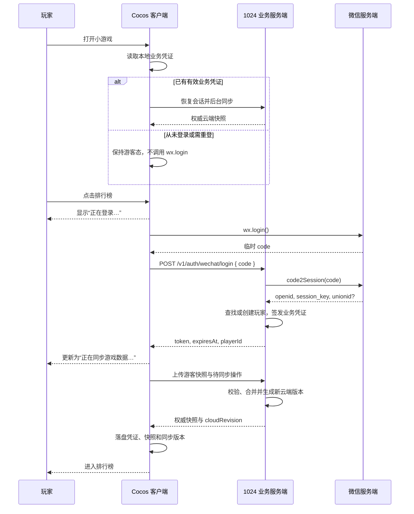

# 需求文档：微信小游戏登录流程

## 一、核心决策

1. 登录不是进入游戏的前置条件。新玩家启动后默认为游客，不在启动时调用 `wx.login`。
2. 游客可正常开始游戏、续局、签到、领取奖励、购买技能并保存本地记录。
3. 首次点击排行榜时，如尚未登录，立即调用 `wx.login`，同时展示“正在登录…”状态。不再增加二次确认弹窗或“微信登录”按钮。
4. 登录成功后立即将游客期的游戏进度、经济数据、签到状态和待同步操作上传云端；首次同步成功后再进入排行榜。
5. 已登录玩家重新启动时，可无感恢复本地业务凭证并在后台同步。

微信小游戏登录仍使用 `wx.login → code2Session → 业务登录凭证` 的标准链路，但只在上述用户主动触发的时机进入该链路。

## 二、目标与范围

### 2.1 目标

- 在微信环境中稳定识别同一玩家。
- 仅在玩家主动触发需要账号的功能时创建微信登录态。
- 为排行榜、成绩、资源同步等服务端功能提供统一身份。
- 支持业务登录态复用、过期重登和网络失败恢复。
- 保证登录前产生的有效本地数据在登录后同步到云端。
- 保持现有 `home.scene` → `loading.scene` → `game.scene` 场景流程不变。

### 2.2 本次不包含

- 用户昵称、头像及其他微信用户资料。
- `wx.getUserInfo`、`wx.createUserInfoButton` 等用户信息授权能力。
- 手机号、实名认证、多平台账号绑定。
- 注销、换绑等账号管理功能。

## 三、登录时机与权衡

### 3.1 平台能力与产品选择

微信官方文档未要求 `wx.login` 必须由用户点击触发，该接口也不会弹出昵称、头像授权框。因此技术上可以在启动时调用。

但本项目的产品原则是“不强制登录”。如果新玩家一打开游戏就调用 `wx.login` 并创建服务端账号，即使没有弹窗，也与该原则不一致。因此做出以下权衡：

- 从未登录过：启动时不调用 `wx.login`，不创建云端玩家。
- 用户点击排行榜：直接在该点击回调中调用 `wx.login`，并展示登录进度。
- 已有未过期业务凭证：启动时可无感恢复会话并同步，因为玩家之前已主动选择登录。
- 旧凭证已过期或被撤销：启动时只记录为“需重登”，等玩家下次触发排行榜或其他线上功能时再执行 `wx.login`。

### 3.2 排行榜登录提示

触发条件：未登录玩家点击首页排行榜。

点击后不显示登录确认页，而是直接进入状态提示：

- 登录中：`正在登录…`
- 登录成功、同步中：`正在同步游戏数据…`
- 完成：自动关闭提示并打开排行榜。
- 失败：显示错误原因，只提供“重试”和“关闭”，不提供“登录”按钮。

登录提示可以是能够遮挡重复点击的轻量状态层，但不应让用户再做一次确认。

## 四、游客与已登录体验

| 功能 | 游客 | 已登录 |
| --- | --- | --- |
| 开始游戏、续局、重玩 | 可用，数据保存本地 | 可用，本地先保存并同步云端 |
| 签到、体力、金币、技能 | 可用，数据保存本地 | 可用，服务端为最终权威数据 |
| 本地进度 | 持续保留 | 同步成功前不删除 |
| 排行榜 | 点击后提示登录 | 同步成功后进入 |
| 断网 | 继续本地游戏 | 继续本地游戏，变更进入待同步队列 |

## 五、完整流程



### 5.1 冷启动

1. 首页直接显示。
2. 客户端只读取本地业务凭证，不调用 `wx.login`。
3. 没有凭证时进入 `guest`，所有非排行榜功能可继续使用。
4. 凭证未过期时恢复为 `authenticated`，在后台执行增量同步。
5. 凭证已过期或服务端返回 `401` 时进入 `reauth-required`，不在启动阶段自动调用 `wx.login`。

### 5.2 首次点击排行榜

1. `guest` 或 `reauth-required`：立即展示“正在登录…”，并在排行榜点击回调中调用 `wx.login`。
2. 业务登录成功：状态文案切换为“正在同步游戏数据…”。
3. 首次同步成功：关闭状态层，打开排行榜。
4. 登录或同步失败：本地数据和待同步队列不清空；显示“重试”和“关闭”。

### 5.3 会话过期与并发去重

- 已登录玩家的业务请求返回 `401` 时，先进入 `reauth-required`，不在后台循环调用 `wx.login`。
- 玩家下次触发排行榜等线上功能时，执行单次重登并在成功后重试原请求一次。
- 多个请求同时触发登录或重登时，只允许一个登录 Promise 运行。
- 所有重试都有上限，不得无限重试。

## 六、客户端设计

### 6.1 模块划分

建议新增以下职责清晰的模块：

- `WechatLoginAdapter`：仅封装微信环境判断和 `wx.login`。
- `AuthApiClient`：负责登录、登录态校验与带凭证请求。
- `PlayerSessionStore`：负责保存纯数据登录快照和去重后的登录 Promise。
- `PlayerCloudSyncStore`：管理 `cloudRevision`、本地快照、待同步操作队列和同步去重。
- `LoginStatusController`：只渲染“登录中/同步中/失败”状态，不提供登录确认按钮，也不直接修改登录状态。
- `HomeSceneController`：处理排行榜入口流程，组合登录、同步和排行榜显示。

`PlayerSessionStore` 和 `PlayerCloudSyncStore` 与 `OngoingGameSession` 一样只保存纯数据，不持有场景节点或组件引用。

### 6.2 状态定义

```ts
type AuthStatus =
  | 'guest'
  | 'restoring'
  | 'logging-in'
  | 'authenticated'
  | 'reauth-required'

type PlayerSessionSnapshot = {
  status: AuthStatus
  token: string | null
  expiresAtMs: number | null
  playerId: string | null
}
```

不得在该快照中增加 `openid`、`session_key`、昵称或头像。

### 6.3 排行榜入口职责调整

当前 `StartPageController.handleRankTap()` 直接显示“敬请期待”。接入时应调整为：

- `StartPageController` 通过 `onRankTap` 回调向外层发出操作，不处理登录。
- `HomeSceneController` 查询 `PlayerSessionStore`。
- 游客时直接启动登录并打开 `LoginStatusController`；已登录时先执行必要同步，然后调用 `StartPageController.showRankModal()`。

这样 UI 只通过回调发出意图，登录和同步状态仍由外层流程控制。

### 6.4 非微信环境

- Creator 编辑器和 Web 预览不调用真实微信登录。
- 开发环境可使用明确标记的本地访客状态，但不得在生产环境开启测试登录接口。

## 七、服务端登录设计

### 7.1 登录接口

`POST /v1/auth/wechat/login`

请求：

```json
{
  "code": "wx.login 返回的临时凭证"
}
```

成功响应：

```json
{
  "data": {
    "token": "业务登录凭证",
    "expiresAt": "2026-10-13T08:00:00.000Z",
    "playerId": "业务玩家 ID",
    "isNewPlayer": true
  }
}
```

要求：

- `code` 必须为非空字符串，并设置严格长度上限。
- 服务端使用配置中的 `appid` 和 `secret` 调用 `code2Session`。
- 以当前小游戏的 `appid + openid` 作为微信身份唯一约束。
- `unionid` 只在未来确实需要跨应用身份打通时使用，当前不作为必填字段。
- 当前不解密用户数据，因此 `session_key` 不下发客户端，也无需为未使用的能力长期保存。
- 同一个 `code` 重复使用必须失败；客户端应重新调用 `wx.login` 获取新 `code`。

### 7.2 登录态校验接口

`GET /v1/auth/session`

请求头：

```text
Authorization: Bearer <token>
```

成功时返回 `playerId` 和 `expiresAt`；凭证过期、已撤销或不可识别时统一返回 `401`。

### 7.3 业务凭证

- 建议使用足够长的随机不透明凭证，服务端只保存凭证哈希。
- 凭证有效期建议为 30 天，新的成功登录可轮换旧凭证。
- 服务端应保存创建时间、过期时间、撤销时间和最后使用时间。
- 客户端本地只保存业务凭证和必要的会话快照。

### 7.4 最小数据字段

玩家表至少需要：

- 业务玩家 ID。
- 微信 `openid`（唯一索引）。
- 账号状态。
- 创建时间和最后登录时间。

会话表至少需要：

- 玩家 ID。
- 凭证哈希。
- 创建时间、过期时间和撤销时间。

不新增昵称和头像字段。如现有数据库已预留相关字段，本次登录也不读写这些字段。

## 八、登录后的云端同步

### 8.1 同步范围

登录成功后，以下数据必须进入云端同步：

- 经济数据：体力、金币、炸弹、木槌、交换技能数量与体力恢复基准。
- 签到数据：最近签到日期、连续签到天数与已领取记录。
- 游戏进度：历史最高分、最高数字、已完成局数和其他个人统计。
- 正在进行的对局：仅上传 `OngoingGameSession` 可表达的纯数据稳定快照，不上传节点、组件或动画中间状态。
- 本地待同步操作：签到、奖励入账、购买、技能消耗、体力消耗和对局结算等。

### 8.2 本地优先与操作队列

为了保持游客和断网时仍可玩，数据变更采用“本地立即落盘 + 后台同步”：

1. 每次经济、签到或对局结算变更都生成唯一 `operationId`。
2. 先更新本地快照，再把操作写入本地 `outbox`。
3. 游客期只累积 `outbox`，不请求云端。
4. 登录后或已登录玩家恢复网络后，按顺序批量上传。
5. 只有服务端返回该 `operationId` 已接受或已处理后，客户端才能从 `outbox` 删除。

服务端对 `playerId + operationId` 建立唯一约束，确保超时重试不会重复发放奖励或重复扣除资源。

### 8.3 同步接口

`POST /v1/player/sync`

请求示例：

```json
{
  "installationId": "本地安装标识，不用作登录凭证",
  "baseRevision": 12,
  "idempotencyKey": "本次同步的唯一标识",
  "guestSnapshot": null,
  "operations": []
}
```

首次登录时 `guestSnapshot` 携带当前完整本地快照；后续仅同步自 `baseRevision` 之后的操作。

成功响应至少包含：

- 服务端时间 `serverTime`。
- 新的 `cloudRevision`。
- 合并后的权威经济、签到、进度和对局快照。
- 已接受、已重复和已拒绝的 `operationId` 列表及原因。

### 8.4 首次登录合并规则

游客存档来自客户端，服务端不能无条件信任。必须在不让正常玩家丢进度与防止数据伪造之间取得平衡。

| 数据 | 合并规则 |
| --- | --- |
| 新建云端玩家 | 允许一次游客快照导入；服务端先执行类型、范围、版本和业务上限校验，并记录已完成导入。 |
| 已有云端存档 | 云端快照为基础；只追加可通过 `operationId` 去重和业务规则验证的本地操作，不用客户端绝对余额直接覆盖云端。 |
| 金币、技能和体力 | 首次导入应用服务端配置的迁移上限；此后仅通过已校验操作增减，服务端为权威余额。 |
| 签到 | 服务端使用统一时区和自然日；同一玩家同一日只能领取一次。游客快照中的未来日期或重复领取不导入，连续天数由服务端重算。 |
| 个人最高分和最高数字 | 可按较大值合并到个人历史，但标记为 `guest_import`。 |
| 公开排行榜成绩 | 不直接使用未验证的游客历史快照上榜。公开排名必须使用登录后提交且经服务端校验的对局结果。 |
| 进行中对局 | 只合并稳定结算点快照；使用云端修订号或对局步数判断新旧，不仅依赖可被修改的设备时间。 |

首次同步必须在服务端事务中完成。客户端只有收到新的 `cloudRevision` 和权威快照后，才能把游客存档标记为“已上云”。

### 8.5 登录后的持续同步

- 在签到、购买、奖励入账、体力或技能消耗、对局结算后调度同步。
- 同一帧或短时间内的多次变更应批量上传，不为每个动画或合并步骤发起请求。
- 应用从后台回到前台、网络恢复或进入排行榜前，如存在待同步操作则立即尝试上传。
- 同步失败不回滚本地游戏操作，而是保留 `outbox` 等待下次同步。
- 下发云端快照时，先合并未确认的本地操作，不得用云端旧快照直接覆盖当前本地进度。

## 九、失败处理

| 场景 | 客户端处理 | 用户提示 |
| --- | --- | --- |
| `wx.login` 失败 | 保持 `guest` 或 `reauth-required` | “登录失败，请稍后重试”，提供“重试/关闭” |
| 登录接口超时或 `5xx` | 允许一次延迟重试，之后保持原状态 | “网络异常，请稍后重试” |
| `code2Session` 返回 code 无效 | 重新调用一次 `wx.login` | 二次仍失败才提示 |
| 业务凭证返回 `401` | 进入 `reauth-required`，在下次线上功能触发时重登 | 启动阶段不弹窗 |
| 首次云同步失败 | 保留业务凭证、本地快照和 `outbox` | “数据同步失败”，提供“重试/关闭” |
| 同步冲突 | 使用服务端返回的新修订号重新合并一次 | 自动处理；仍失败再提示 |
| 服务端返回 `429` | 不立即重试，按服务端给出的时间退避 | “操作频繁，请稍后再试” |

所有自动重试都必须有次数上限，不得使用无限循环或高频定时器轮询。

## 十、安全与隐私

- 微信 `secret` 只保存在服务端环境变量中，不得写入 Cocos 项目或提交到 Git。
- 客户端不得直接调用 `code2Session`。
- 客户端不保存 `openid`、`session_key` 或微信 `secret`。
- 业务接口必须使用 HTTPS，并将域名配置到微信合法 request 域名。
- 不记录完整 `code`、业务 token、`session_key` 或 `openid` 明文；排查问题使用请求 ID 和业务玩家 ID。
- 服务端对登录接口做 IP、设备会话和全局频率限制。
- 客户端上传的游客快照和操作不可信，服务端必须校验类型、数值范围、状态转换、幂等键和业务上限。
- 游客导入的历史成绩可保存为个人进度，但不得未经校验直接进入公开排行榜。
- 本次不调用任何用户信息授权接口，不采集昵称和头像。

## 十一、接入点

### 11.1 Cocos 客户端

- `HomeSceneController.start()` 只恢复已有业务凭证；无凭证时保持游客态，不触发 `wx.login`。
- `StartPageController` 新增 `onRankTap` 回调，不再由 UI 内部直接决定排行榜开启或登录。
- `HomeSceneController` 在收到排行榜点击后组合登录、同步和开榜流程。
- `loading.scene` 继续只负责玩法场景和资源预加载。
- `PlayerEconomyStore` 保留对外的纯数据操作边界，内部增加快照版本、操作记录与云端权威快照应用能力。
- `OngoingGameSession` 只在落子和全盘结算完成后产生可同步快照，不在下落、合并、重力或技能动画中上传中间状态。

### 11.2 业务服务端

- 在 Fastify 中增加登录路由，参数使用 JSON Schema 校验。
- 新增同步路由、云端快照、修订号和操作幂等记录。
- 微信接口调用、玩家查找/创建、会话签发分别放在独立 service 与 repository 中。
- 同步路由只处理身份验证、参数校验和响应转换；合并规则放入独立 service，数据读写放入 repository。
- 数据库变更使用新的顺序迁移脚本，不覆盖已执行的初始化脚本。

## 十二、验收标准

- 新玩家首次进入时不调用 `wx.login`，不在服务端创建账号。
- 游客可以正常游戏、续局、签到、领奖、购买和使用技能。
- 未登录玩家点击排行榜时立即看到“正在登录…”，页面不出现“登录”按钮。
- 排行榜点击后才调用 `wx.login`，启动阶段不凭空发起新登录。
- 首次登录能在服务端创建唯一账号，并在进入排行榜前完成游客数据同步。
- 同一微信玩家多次登录时始终对应同一业务玩家。
- 本地业务凭证有效时可正常恢复登录态。
- 凭证过期后不在启动时自动重登；下次触发线上功能时可完成单次重登。
- 连续快速触发多个线上请求时，不会并发创建多个登录流程。
- 断网、超时、微信 code 无效和服务端 `5xx` 都有明确的退化行为。
- 同步失败时不清空本地快照或待同步队列，恢复网络后可继续同步。
- 同一签到、奖励、购买或消耗操作重试多次不会重复入账或扣除。
- 云端已有存档时，客户端绝对余额不会直接覆盖云端。
- 游客历史成绩可保留为个人数据，但不会未经校验直接进入公开排行榜。
- 登录过程不弹出昵称或头像授权，也不调用用户信息接口。
- 无网络时仍能进入现有本地游戏流程。
- Creator Web 预览不因缺少 `wx` 对象报错。
- 微信开发者工具和真机中均能完成登录及过期重登验证。

## 十三、建议开发顺序

1. 在服务端增加玩家身份唯一约束和会话表迁移。
2. 实现微信 `code2Session` 适配层和登录接口。
3. 实现业务凭证签发、校验、过期和撤销。
4. 实现云端快照、操作幂等表、同步接口和合并规则。
5. 在 Cocos 客户端增加微信适配层、API 层、会话仓库、同步队列和状态提示。
6. 调整 `PlayerEconomyStore`，使所有需上云的变更产生幂等操作记录。
7. 将排行榜点击流程接入登录、首次同步和开榜。
8. 补齐失败退化、单次重试、并发去重与同步冲突处理。
9. 在微信开发者工具与真机中完成验收。

## 十四、官方参考

- [wx.login](https://developers.weixin.qq.com/minigame/dev/api/open-api/login/wx.login.html)
- [小程序登录凭证校验 code2Session](https://developers.weixin.qq.com/miniprogram/dev/server/API/user-login/api_code2session.html)
- [微信小游戏登录指引](https://developers.weixin.qq.com/minigame/dev/guide/open-ability/login.html)
- [微信小游戏隐私合规开发指南](https://developers.weixin.qq.com/minigame/dev/guide/open-ability/privacy.html)

本文档官方接口信息核对日期：2026-09-13。
